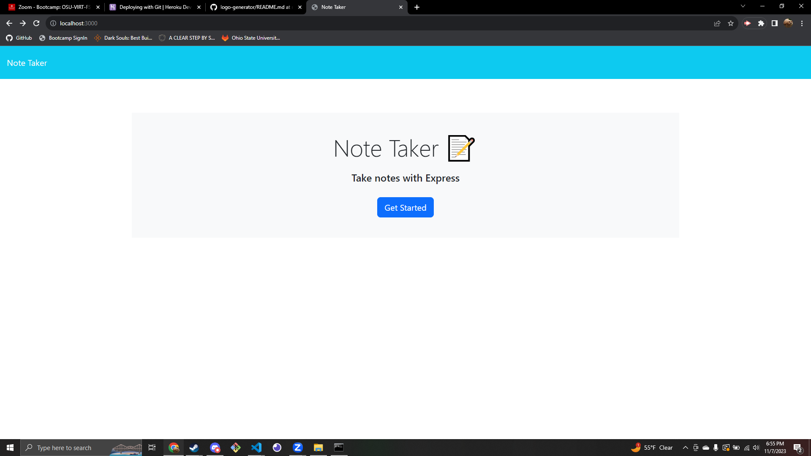
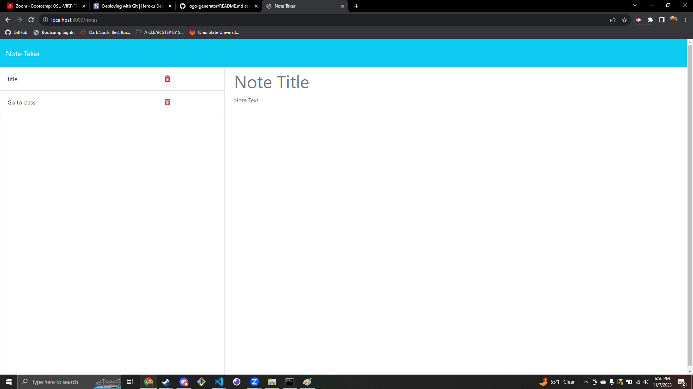

# note-tracker-app

## Description

An application that allows a user to create and save notes. When a note is created it is added to a database and displays the newly created note on the side bar of the page. When a user selects a note from the sidebar it will be displayed on the main section of the webpage.

## Screenshots

## Deployment Link

https://silverfoot42-note-taker-app-0045722284dd.herokuapp.com/
